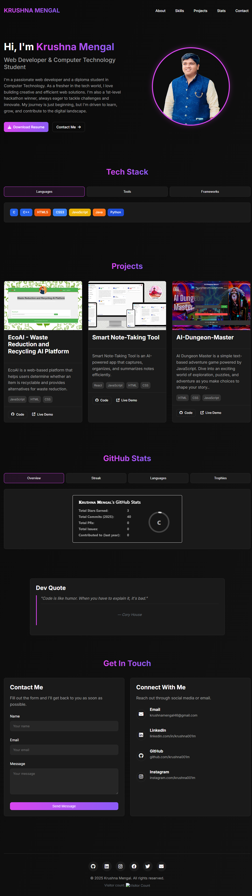

# KRUSHNA MENGAL
# Krushna Mengal Portfolio

Welcome to my personal portfolio repository! This project showcases my skills and experience as a **Web Developer** and **Computer Technology Student**.

## 🚀 Project Overview
This portfolio highlights my:
- 🌐 Web development projects  
- 🏆 Hackathon achievements  
- 📜 Skills and professional experience  

## 🛠️ Technologies Used
- **HTML** – Structure of the website  
- **CSS** – Styling and responsiveness  
- **JavaScript** – Dynamic interactivity  

## 📸 Preview


## 📥 Installation
1. Clone the repository:  
```bash
git clone https://github.com/krushna001m/KRUSHNA-MENGAL.git
